## Psychology

>- Fantastic talks today showcasing the highest quality psychological research
* But it wasn’t always this way...
* The heady of days of the early noughties
* Where social priming research was still a thing

>- 

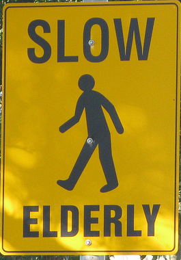

>- And ego-depletion could explain why you might not pay attention to what im saying
>- If only life was still so simple and easy...

--- .class ##id  

## Hack Your Way To Scientific Glory

* A hands on tutorial:

> https://projects.fivethirtyeight.com/p-hacking/

--- .class ##id  

## Hack Your Way To Scientific Glory

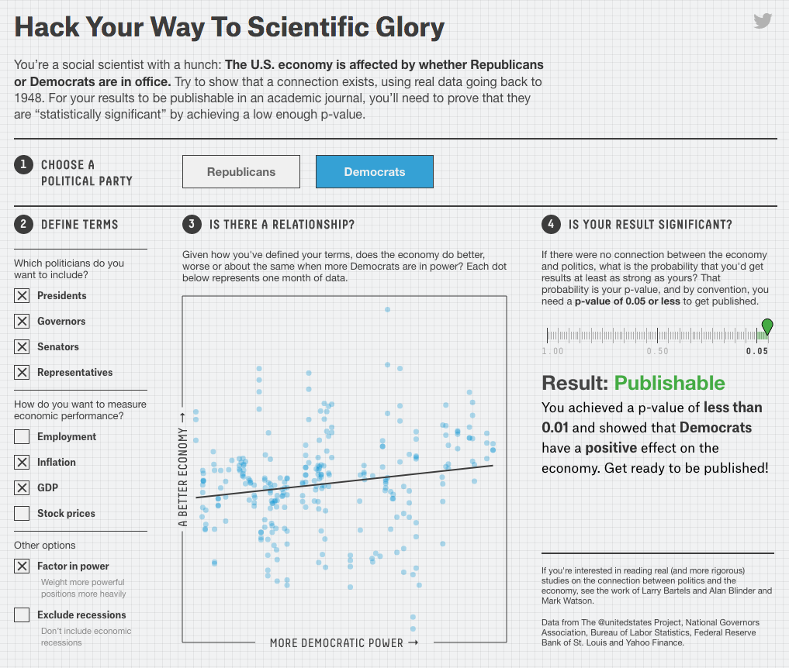

* fivethirtyeight.com/features/science-isnt-broken

--- .class ##id  

## Hack Your Way To Scientific Glory

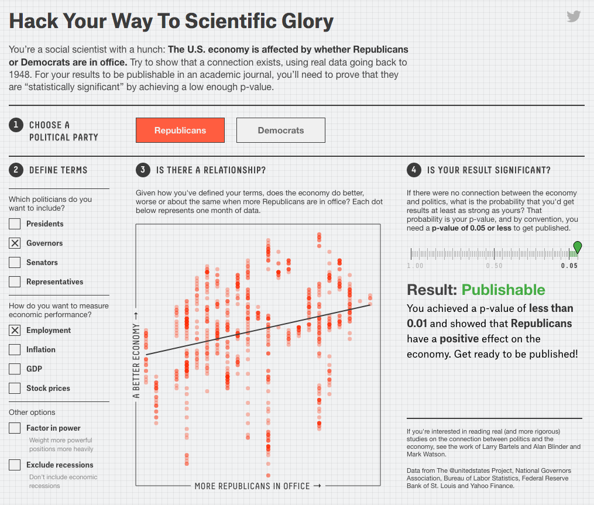

* fivethirtyeight.com/features/science-isnt-broken

--- .class ##id  

## Same data, different results

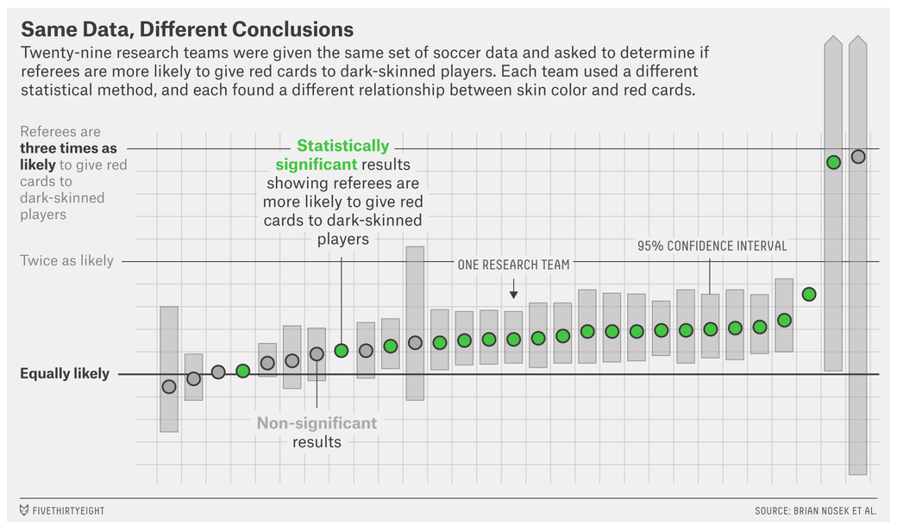

* fivethirtyeight.com, Nosek et al., 2015

--- .class ##id  

## The replication crisis 

>- Things caught up with psychology and revealed some ugly truths
* The Open Science Collaboration and the reproducability project
* 100 replications, 266 co-authors
* Sampled articles published in 2008 in Psych Science, JEP:LMC and JPSP
* Full article published in Science, 2015

--- .class ##id  

## Results

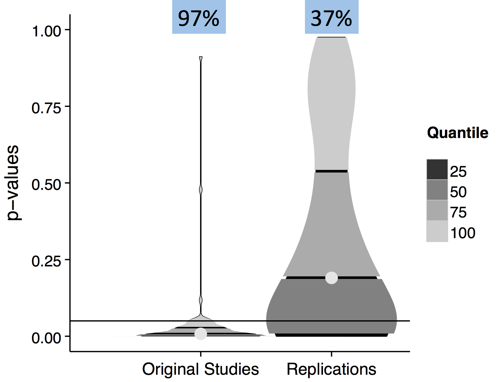

*Nosek, 2015 Open Science Centre Slides

--- .class ##id  

## Results

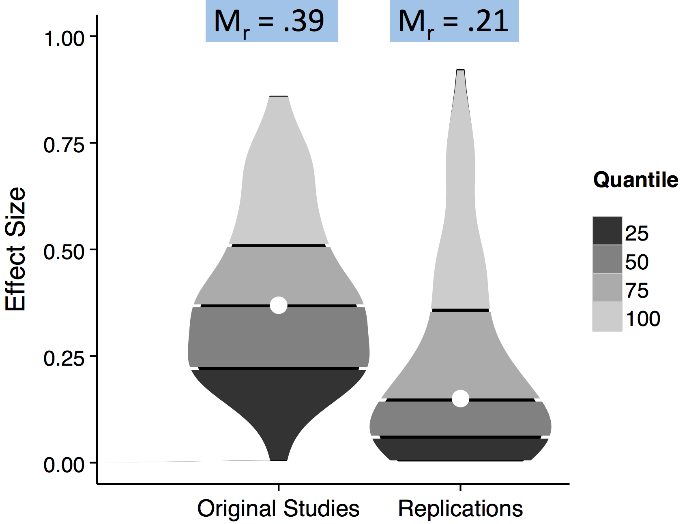

*Nosek, 2015 Open Science Centre Slides

--- .class ##id  

## Was this really a surprise? 

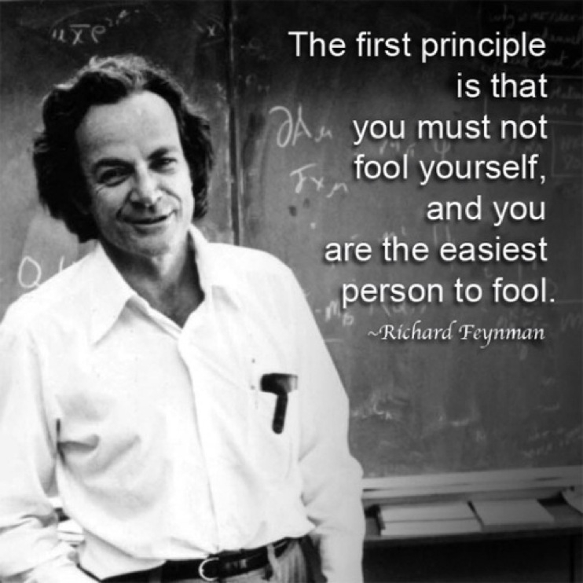

--- .class ##id  

## Prediction markets

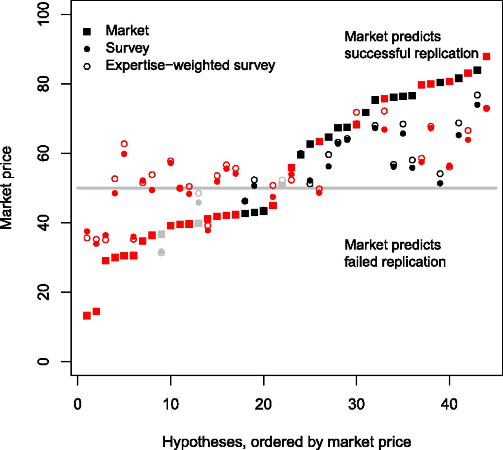

Deber et al 2015, __PNAS__: Final market prices and survey predictions are shown for the replication of 44 publications from 3 top psychology journals. 29 out of 41 replications were correct, yielding better predictions than a survey carried out before trading started. Successful replications are shown in black, and failed replications are shown in red. Gray symbols are replications that remained unfinished (3 of 44).

--- .class ##id  

## Not just psychology!...

* But pervasive across academia

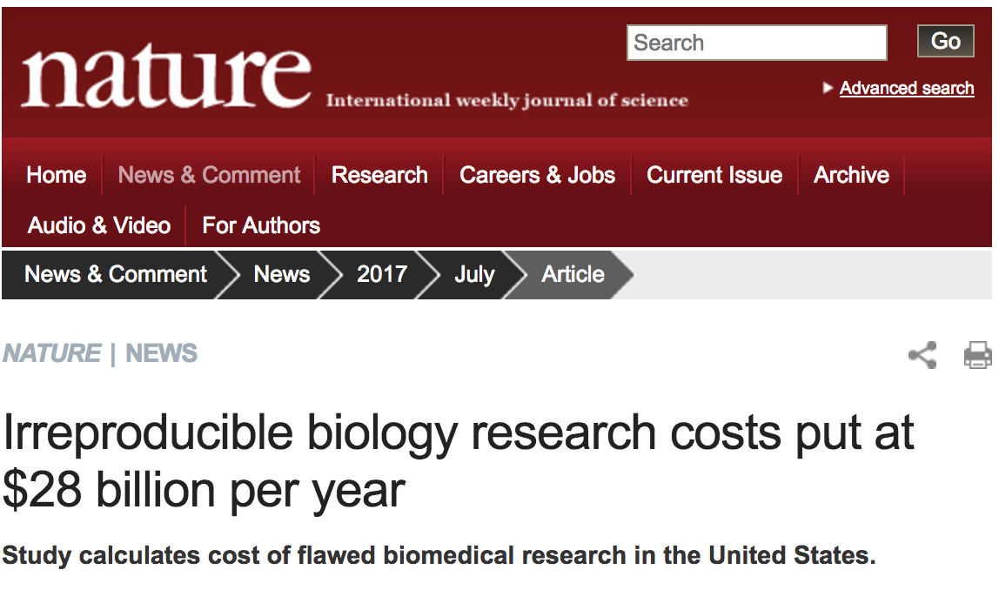

* Exciting results often trumps honest science 
* What can we do? 
* "Open Science" - might help address some of these issues

--- .class ##id  

## What is open science? 

> Open science is the movement to make scientific research, data and dissemination accessible to all levels of an inquiring society, amateur or professional.

* Source: Wikipedia

--- .class ##id  

## What is open science? 

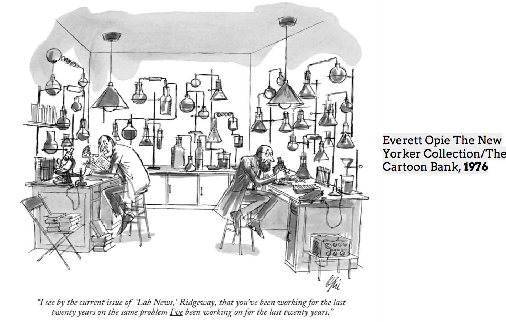

--- .class ##id  

## Why should science be open?

The obvious ones:
>- Thorough evaluation requires a clear understanding of the methods and analysis approaches used
* Reproducibility 
* Replicability

--- .class ##id  

## Why should science be open?

The slightly less obvious ones:
>- To increase the efficiency of research
* Fulfill ethical obligations to participants and the public
* Provide information to potential participants
and the research community
* Facilitate systematic reviews and meta analyses

--- .class ##id  

## Why should science be open? 

**It will have to be whether we like it or not**

>- Reporting guidelines- http://www.equator-network.org/reporting-guidelines/
* Funder/government mandates -  http://datasharing.sparcopen.org
* Journal polices -  https://cos.io/top/
* Rewards for open practices - more later

--- .class ##id  

## Doing open science

* Many different ways to be __open__ 

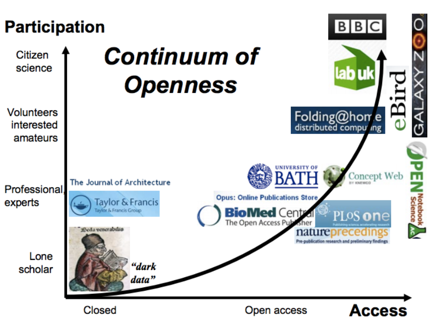

* Lyon, 2009 

* PAC Lab not yet "fully open"...

* Preprint, registered report, github code available in the last 12 months

--- .class ##id  

## What do we need to do to be open? 

Transparency and Openness Promotion (TOP) Guidelines

1. Data citation
2. Design transparency
3. Research materials transparency
4. Data transparency
5. Analytic methods (code) transparency
6. __Preregistration of studies__
7. __Preregistration of analysis plans__
8. Replication

--- .class ##id  

##  TOP Guidelines Signatories

* Journals, Organizations, Funders
* 500+ journals 50+ organizations
* h/p://osf.io/9f6gx

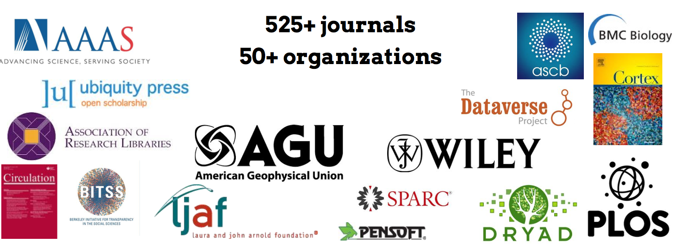

--- .class ##id  

## Registered Reports?

>- Publish your introduction and methods BEFORE running your study
* The file drawer effect
* P-Hacking: Unreported flexibility in data analysis
* HARKing: Hypothesizing After Results are Known
* Growing number of journals accepting registered reports that guarantee publication if accepted (provided you do what you said you would!)
* eLife, Attention, Perception and Psychophysics, Cerebral Cortex, Experimental Psychology

--- .class ##id  

## Registered Reports

 
- See the full list of journals: osf.io/8mpji

--- .class ##id  

##  Rewards and decision-making

>- Motivate participants through payments or "credits"?
>- Pychologists come even cheaper than that...
>- It seems researchers __REALLY__ like badges

--- .class ##id  

##  Promoting Open Science through badges

>- Badges to acknowledge open practices
>- Making behaviours visible promotes adoption
>- **How do I get my hands on some badges?**

--- .class ##id  

##  Promoting Open Science through badges

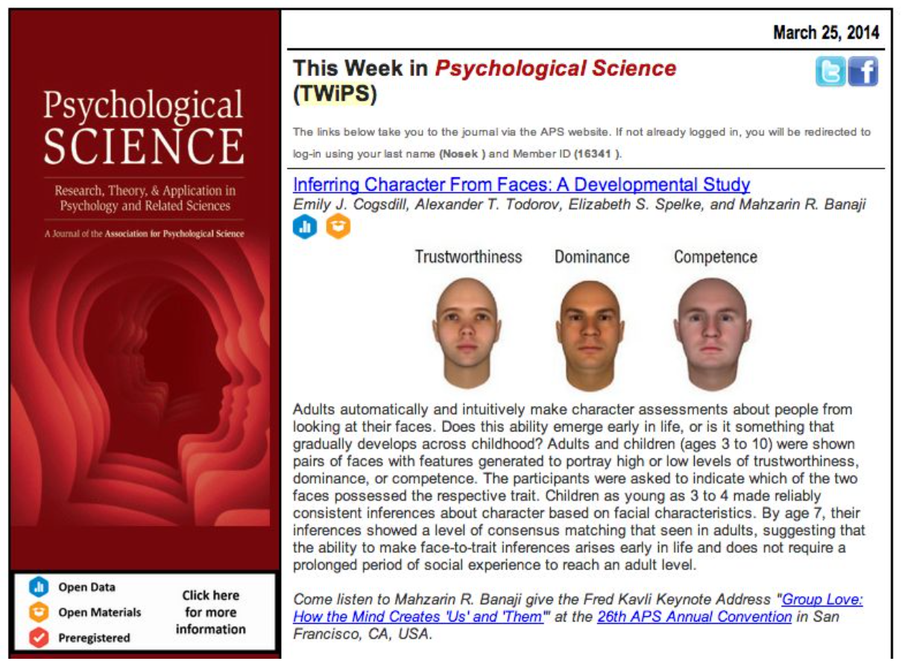

--- .class ##id 

##  Open science & badges

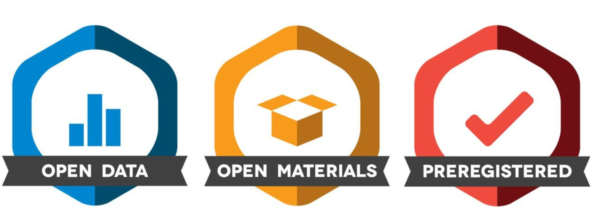

--- .class ##id  
 
##  Open science & badges

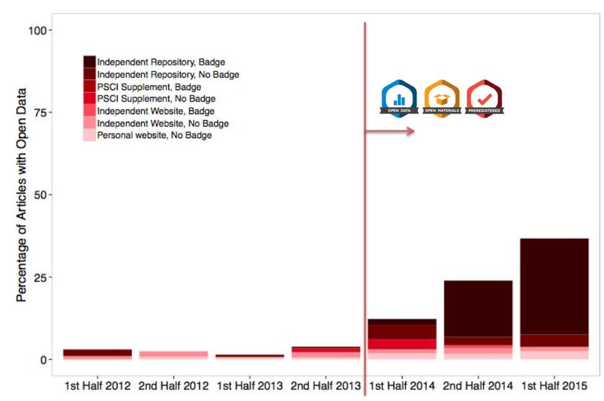

--- .class ##id  

## Badge 1: Open Data

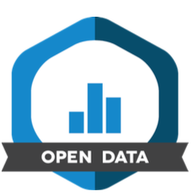

* Digitally-shareable data are publicly available on an open-access repository (e.g., university repository or one at www.re3data.org or www.databib.org)

* A codebook is included with sufficient description for an independent researcher to reproduce the reported analyses and results. Data from the same project that are not needed to reproduce the reported results can be kept private without losing eligibility for the Open Data badge.

--- .class ##id  

## Standardised formats

* Proprietary formats are the __devil's work__

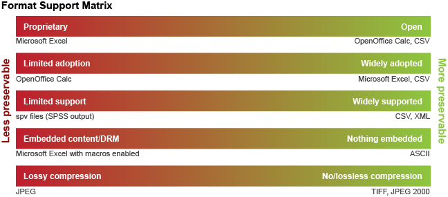

* Use open and/or widely adopted software wherever possible
* Initiatives in neuroscience to standardise formats: BIDS format for fMRI & ongoing discussions about EEG

--- .class ##id  

## Badge 2: Open Materials

* Digitally-shareable materials are publicly available on an open-access repository

* Infrastructure, equipment, biological materials, or other components that cannot be shared digitally are described in sufficient detail for an independent researcher to understand how to reproduce the procedure

* Sufficient explanation for an independent researcher to understand how the materials relate to the reported methodology

--- .class ##id  

## Badge 3: Pre-registered

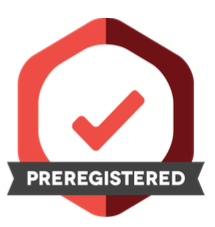

* A public date-time stamped registration is in an institutional registration system (e.g., ClinicalTrials.gov, Open Science Framework)
* Registration __pre-dates__ realisation of the outcomes
* Registered design and analysis plan corresponds directly to reported design and analysis
* Full disclosure of results following the registered plan

--- .class ##id  
 
## Open Science Framework 

* Key player in promoting open Science: Centre for Open Science

> Misson- Improve openness, integrity, and reproducibility of scientific research

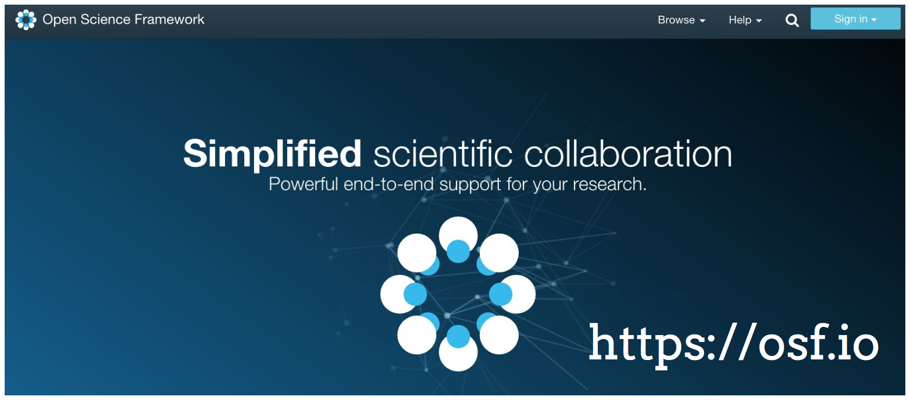

--- .class ##id  

## Open Science Framework 

* Online resource for collaboration, documentation and archiving
* Includes version control
* Persistent Citable Identifiers
* Pre-registration of ideas to prevent HARKING (more next)
* Connects the software and services you are already using

--- .class ##id

## Open Science Framework

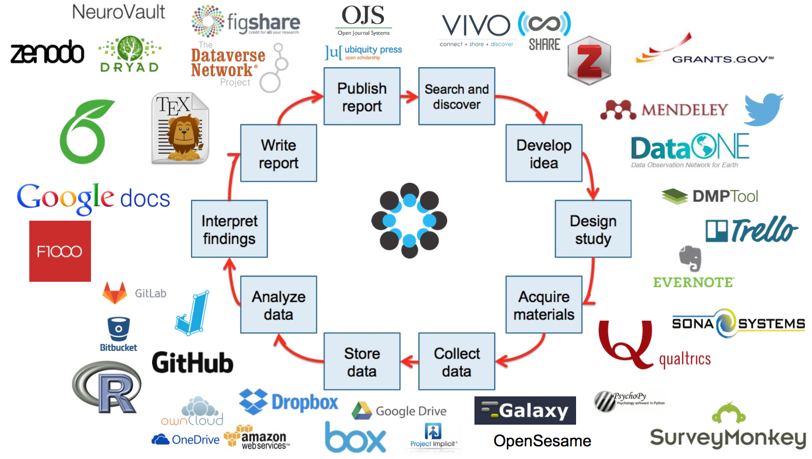

--- .class ##id  

## Open Science Framework

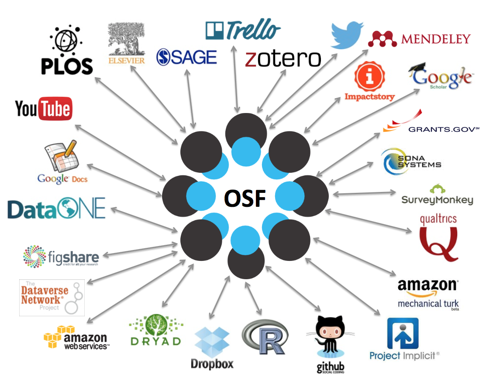

--- .class ##id 

## Resources to get started

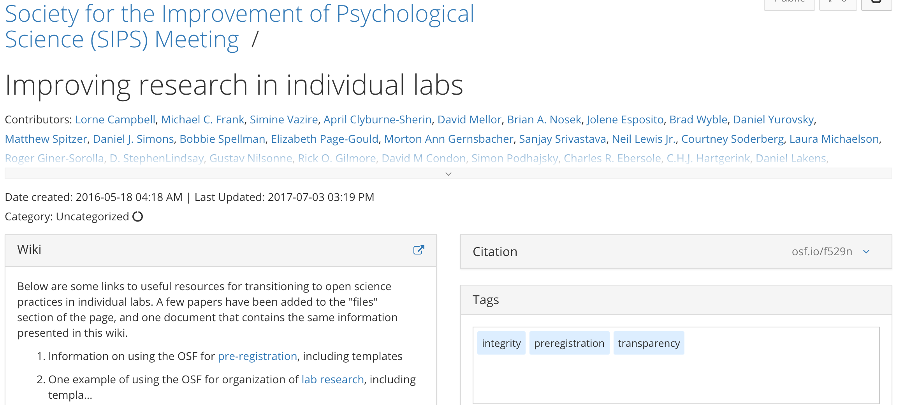

--- .class ##id 

## Bibliography

* Begley, C. G., & Ellis, L. M. (2012). Drug development: Raise standards for preclinical cancer research. Nature, 483, 531–533.
* Freedman LP, Cockburn IM, Simcoe TS. The economics of reproducibility in preclinical research. PLoS Biol 2015; 13: e1002165.
* __Heavily__ borrowed from COS throughout: https://osf.io/e92ub
* Lyon, L. (2009). Open science at web-scale: Optimising participation and predictive potential consultative report. Retrieved September 10, 2015, from http://opus.bath.ac.uk/30056/1/open-science-report-6nov09-final-sentojisc.pdf.
* Open Science Collaboration. (2015). Estimating the reproducibility of psychological science. Science, 28; 349: aac4716.